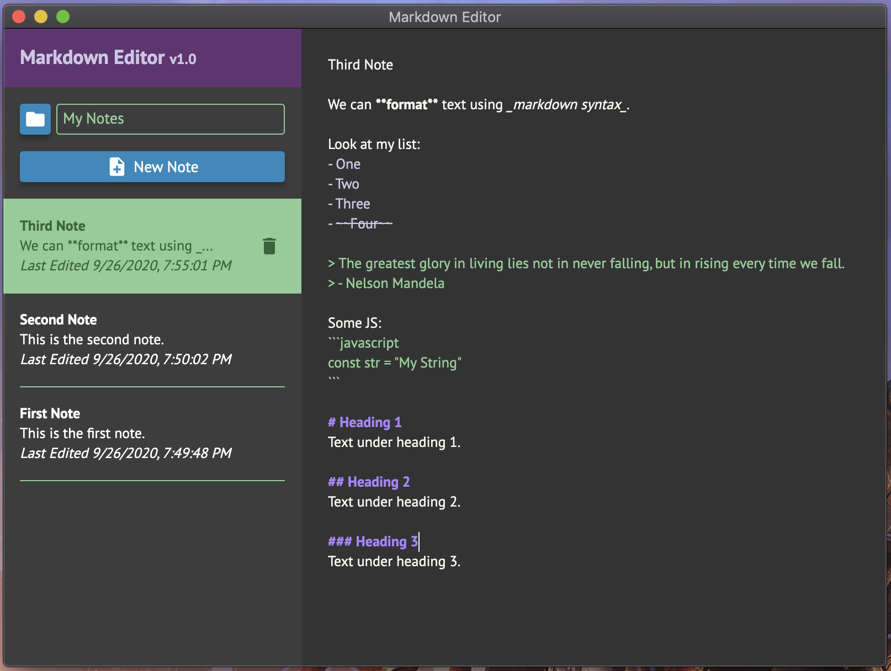

# Markdown Editor

An electron app that allows you to take notes using markdown.

## Designs



## User Stories

As a user, I should be able to choose the main directory my notes will be saved in, so that they are stored in the location of my choosing.

As a user, I want to create a note, so that I can write markdown based notes.

-   The first line of a note should be its title.
-   As I write in markdown, the text should be syntax highlighted.

As a user, I want to be able to delete a note, so that I can remove notes that are not needed.

-   Should ask for confirmation before deleting.

As a user, I want to see a list of my notes, so that I know which notes have been created.

-   List should be in order of most recently edited.
-   Notes in list should show note title, date edited, and the first few words of the note.
-   Should be able to click on a note to open/edit it

## Developer Commands

Build

```
npm run build
```

Run App

```
npm run start
```

Tests

```
npm run test
```

E2E Tests

```
npm run test:e2e
```

Create Executable (Windows)

```
npm run distribute:windows
```

Create Executable (Mac)

```
npm run distribute:mac
```
